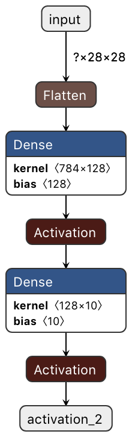

# Mostly Hand-Translated Simple Keras Model to C Language

This is a very simple example to translate already trained Keras
(slightly) deep neural network model to C language project.

Recently, we can access some well organized projects which can convert
Keras model to C project, but I wrote this because I wanted to
understand Keras and deep neural network models much deeper.

## Sample Keras model

Used sample models is as follows.  The first activation is ReLU and
the latter is softmax.  The model is trained by MNIST dataset.
Usually, Convolutional Neural Network is a better choice, but I
adopted the model for easier understanding.



## How to evaluate this

First, you need to run Jupyter Notebook project below.  I assume
required software (Keras, etc.) were already installed.

- [mnist_keras_to_c.ipynb](./mnist_keras_to_c.ipynb)

By running the notebook, it generates the following files.

````
├── mnist.h5
├── c_project
│   └── src
│       ├── test_images.[ch]
│       ├── test_labels.[ch]
│       ├── params.h
````

After that, you can build the C project as following.  C compiler,
make and other tolls are also required.

````
$ cd ./c_project/build
$ make clean all
````

To run the code,

````
$ ./mnist_c
````

You will see following outputs or similar (one of 20 sample outputs).
It means that the Keras model inferred that the last (or #19) input
sample was labeled '4', or the '4' had the highest probability by
softmax activation function.

````
Input sample #19:
  0   0   0   0   0   0   0   0   0   0   0   0   0   0   0   0   0   0   0   0   0   0   0   0   0   0   0   0 
  0   0   0   0   0   0   0   0   0   0   0   0   0   0   0   0   0   0   0   0   0   0   0   0   0   0   0   0 
  0   0   0   0   0   0   0   0   0   0   0   0   0   0   0   0   0   0   0   0   0   0   0   0   0   0   0   0 
  0   0   0   0   0   0   0   0   0   0   0   0   0   0   0   0   0   0   0   0   0   0   0   0   0   0   0   0 
  0   0   0   0   0   0   0   0   0   0   0   0   0   0   0   0   0   0   0   0   0   0   0   0   0   0   0   0 
  0   0   0   0   0   0   0   0   0   0   0   0   0   0   0   0   0   0 168  91   0   0   0   0   0   0   0   0 
  0   0   0   0   0   0   0   0   0   0   0   0   0   0   0   0   0   2 234 126   0   0   0   0   0   0   0   0 
  0   0   0   0   0   0   0   0   0   0   0   0   0   0   0   0   0  51 254 126   0   0   0   0   0   0   0   0 
  0   0   0   0   0   0   0   0   0  38 178  31   0   0   0   0   0  51 254  81   0   0   0   0   0   0   0   0 
  0   0   0   0   0   0   0   0   0  94 254  83   0   0   0   0   0  87 254  54   0   0   0   0   0   0   0   0 
  0   0   0   0   0   0   0   0   0 160 254  56   0   0   0   0   0 189 238   4   0   0   0   0   0   0   0   0 
  0   0   0   0   0   0   0   0  13 227 168   2   0   0   0   0   0 194 236   0   0   0   0   0   0   0   0   0 
  0   0   0   0   0   0   0   0  55 254 114   0   0   0   0   0  16 235 167   0   0   0   0   0   0   0   0   0 
  0   0   0   0   0   0   0   0 115 254  50   0   0   0   0   0 103 254 105   0   0   0   0   0   0   0   0   0 
  0   0   0   0   0   0   0   7 221 236  75 156 180 190 252 252 253 254 114   0   0   0   0   0   0   0   0   0 
  0   0   0   0   0   0   0  15 254 254 254 252 211 179 179 179 246 254 247  94   0   0   0   0   0   0   0   0 
  0   0   0   0   0   0   0   8 217 239 117  22   0   0   0   0 226 254 242 197   0   0   0   0   0   0   0   0 
  0   0   0   0   0   0   0   0  14  18   0   0   0   0   0  27 243 207  46  37   0   0   0   0   0   0   0   0 
  0   0   0   0   0   0   0   0   0   0   0   0   0   0   0  99 254 132   0   0   0   0   0   0   0   0   0   0 
  0   0   0   0   0   0   0   0   0   0   0   0   0   0   0 116 254  67   0   0   0   0   0   0   0   0   0   0 
  0   0   0   0   0   0   0   0   0   0   0   0   0   0   0 116 254  61   0   0   0   0   0   0   0   0   0   0 
  0   0   0   0   0   0   0   0   0   0   0   0   0   0   0 116 254  61   0   0   0   0   0   0   0   0   0   0 
  0   0   0   0   0   0   0   0   0   0   0   0   0   0   0 174 255 100   0   0   0   0   0   0   0   0   0   0 
  0   0   0   0   0   0   0   0   0   0   0   0   0   0   0 187 254  83   0   0   0   0   0   0   0   0   0   0 
  0   0   0   0   0   0   0   0   0   0   0   0   0   0   0 115 176  10   0   0   0   0   0   0   0   0   0   0 
  0   0   0   0   0   0   0   0   0   0   0   0   0   0   0   0   0   0   0   0   0   0   0   0   0   0   0   0 
  0   0   0   0   0   0   0   0   0   0   0   0   0   0   0   0   0   0   0   0   0   0   0   0   0   0   0   0 
  0   0   0   0   0   0   0   0   0   0   0   0   0   0   0   0   0   0   0   0   0   0   0   0   0   0   0   0 
0: 0.00
1: 0.00
2: 0.00
3: 0.00
4: 1.00
5: 0.00
6: 0.00
7: 0.00
8: 0.00
9: 0.00
````

If the inference was incorrect, you will see the following warning
line.

````
Inference was incorrect!
````

## Helpful Tools

As mentioned above, recently we can access well organized projects
which can converts Keras model to C language.  Followings are some
examples I know.

- https://github.com/majianjia/nnom
- https://www.tensorflow.org/lite/microcontrollers/overview
- https://www.st.com/en/embedded-software/x-cube-ai.html

NNoM looks great though it seems converting trained parameters to
8-bit integer values.  (8-bit parameters look fine enough by scaling
(or shifting) .)

TensorFlow Lite requires C++ though C++ is not always good candidate
for MCU (Microcontrollers).

X-CUBE-AI is a great product but only for STMicroelectronics STM32
series MCU.

Atsushi Yokoyama, Firmlogics
